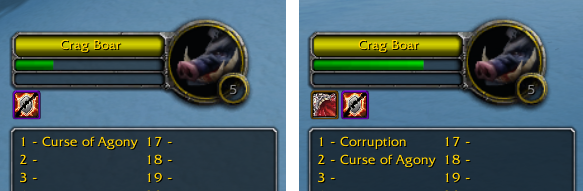

# VplusTestUglyDebuffs
Addon for Vanilla Plus server.

### Installation:
1. [Download](https://github.com/for-wow/VplusTestUglyDebuffs/archive/refs/heads/main.zip) the current version of the source code
2. Open folder in the archive
3. Copy folder `VplusTestUglyDebuffs` to addons folder: `.. \ WOW \ Interface \ AddOns \`

### Description:
The addon scans the combat log and tries to find the events of the start and end of the debuff. These events change the frame's line list. When the target is changed, the line list is cleared. I'm not sure this addon finds all debuff start events and I ask you to check it with different classes.

